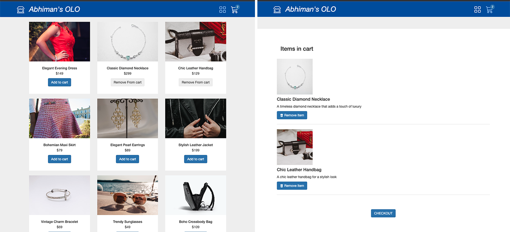

# React Redux Toolkit Shopping Cart

This React JS project, powered by Vite, leverages the efficiency of Redux Toolkit to manage state. It features meticulously crafted Redux slices for seamless handling of product data and cart actions. To simulate API interactions, Json Server is employed, while the asynchronous fetching of data is elegantly orchestrated through the use of Async Thunk.



## Getting Started

1. Clone the repository:

   ```bash
   git clone https://github.com/abhimax/react-redux-tk-shopping-cart.git
   cd react-redux-tk-shopping-cart
   ```

2. Install dependencies

   ```bash
   npm install
   ```

3. Open a new terminal and start the development server:
   ```bash
   npx json-server './src/data/productList.json'
   ```
4. Open your browser and visit http://localhost:5173/ to view the project.

## Features

### Product Data Handling

The productSlice is responsible for managing product data. It includes an async data fetching feature using createAsyncThunk for fetching product data from the mock API.

### Shopping Cart Management

The cartSlice handles the state of the shopping cart, providing the following features:

#### Add to Cart:

- Adds a product to the shopping cart.

#### Remove from Cart:

- Removes a product from the shopping cart.

#### Clear All Items:

- Clears all items from the shopping cart.

Feel free to explore and modify the slices based on your project's needs.

## Tech Stack

**Vite** - Blazing fast build tool for modern web development.
**React** - A JavaScript library for building user interfaces.
**Redux Toolkit** - The official, opinionated, batteries-included toolset for efficient Redux development.
**JSON Server** - Get a full fake REST API with zero coding in less than 30 seconds (seriously).
**SASS** - a preprocessor scripting language that is interpreted or compiled into Cascading Style Sheets
